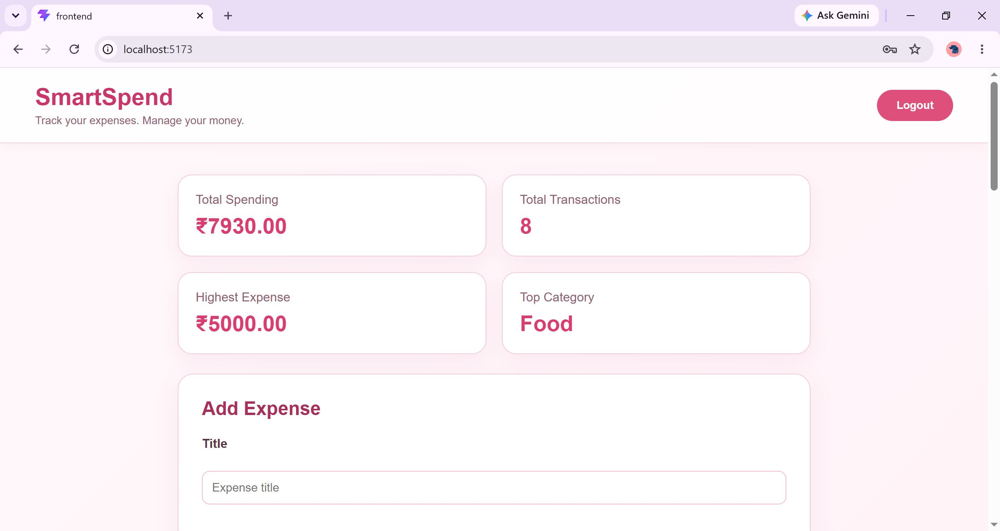

# SmartSpend

## Live Demo

🚀 **Live Application:** https://smartspend-frontend-cjq9.onrender.com/

📂 **GitHub Repository:** https://github.com/hasini-gujjula/SmartSpend

##Project Overview

SmartSpend is a full-stack expense management application that helps users securely track, manage, and analyze their personal expenses.

Users can create an account, securely log in using JWT authentication, add and manage expenses, search and filter transactions, view spending statistics, and navigate through paginated expense records.

The application is built with React on the frontend, Spring Boot on the backend, and MySQL for persistent data storage.

## Screenshots

### Login


### Registration


### Dashboard



### Expense Management


### Edit Expense


## Features

- 🔐 User registration and secure login with JWT authentication
- 🔒 Password encryption using BCrypt
- 💰 Add, edit, and delete expenses
- 🔎 Search expenses by title
- 🏷️ Filter expenses by category
- 📄 Pagination for expense records
- 📊 Spending statistics and summary cards
- 👤 User-specific expense data isolation
- ✅ Request validation and error handling
- 🌐 RESTful API architecture
- 📱 Responsive React user interface
- 🚀 Deployed frontend and backend
- 🗄️ Cloud MySQL database

## Tech Stack

### Frontend
- React
- Vite
- JavaScript
- HTML5
- CSS3

### Backend
- Java 17
- Spring Boot
- Spring Security
- Spring Data JPA
- Maven

### Database
- MySQL 8
- Aiven MySQL

### Authentication & Security
- JWT (JSON Web Tokens)
- BCrypt password hashing
- CORS
- Stateless authentication

### Deployment
- Render — Frontend & Backend
- Aiven — Cloud MySQL Database

### Development & Testing
- IntelliJ IDEA
- Visual Studio Code
- Postman
- Git & GitHub

## Architecture

SmartSpend follows a layered architecture to separate responsibilities and keep the application maintainable.

```text
React Frontend
      |
      | REST API + JSON
      ↓
Spring Boot Backend
      |
      ├── Controller Layer
      ├── Service Layer
      ├── Repository Layer
      ├── Security Layer
      └── DTO / Exception Handling
      |
      ↓
MySQL Database

## API Endpoints

### Authentication

| Method | Endpoint | Description | Authentication |
|---|---|---|---|
| POST | `/api/auth/register` | Register a new user | Public |
| POST | `/api/auth/login` | Login and receive JWT token | Public |

### Expenses

| Method | Endpoint | Description | Authentication |
|---|---|---|---|
| POST | `/api/expenses` | Add a new expense | JWT |
| GET | `/api/expenses` | Get user's expenses | JWT |
| GET | `/api/expenses/stats` | Get spending statistics | JWT |
| PUT | `/api/expenses/{id}` | Update an expense | JWT |
| DELETE | `/api/expenses/{id}` | Delete an expense | JWT |

### Expense Search & Filtering

The expense listing endpoint supports:

- `search` — Search expenses by title
- `category` — Filter by category
- `page` — Select page number
- `size` — Control the number of records per page

Example:

```text
GET /api/expenses?search=food&category=Food&page=0&size=5

## Security

SmartSpend implements several security measures:

- JWT-based authentication for protected REST APIs
- BCrypt password hashing instead of storing plain-text passwords
- Stateless authentication using Spring Security
- User-specific authorization for expense operations
- Users can only access, update, or delete their own expenses
- CORS configuration for the deployed frontend
- Environment variables used for sensitive configuration
- Request validation for user and expense data

## Project Structure

```text
SmartSpend/
├── backend/
│   ├── src/main/java/com/smartspend/
│   │   ├── config/
│   │   ├── controller/
│   │   ├── dto/
│   │   ├── entity/
│   │   ├── exception/
│   │   ├── repository/
│   │   ├── security/
│   │   └── service/
│   ├── src/main/resources/
│   ├── Dockerfile
│   └── pom.xml
│
├── frontend/
│   ├── src/
│   ├── .env.example
│   ├── package.json
│   └── vite.config.js
│
├── screenshots/
├── .gitignore
└── README.md

## Local Setup

### Prerequisites

Make sure you have the following installed:

- Java 17
- Maven
- Node.js
- MySQL 8
- Git

### 1. Clone the repository

```bash
git clone https://github.com/hasini-gujjula/SmartSpend.git
cd SmartSpend


### 2. Configure the backend

DB_URL
DB_USERNAME
DB_PASSWORD
JWT_SECRET

### 3. Start the backend

cd backend
mvn spring-boot:run

### 4. Start the frontend

cd frontend
npm install
npm run dev

## Deployment

SmartSpend is deployed using the following services:

- **Frontend:** Render Static Site
- **Backend:** Render Web Service
- **Database:** Aiven MySQL

### Live Application

🚀 https://smartspend-frontend-cjq9.onrender.com/

### Backend API

🔗 https://smartspend-backend-tkmr.onrender.com/

## Future Improvements

- Add expense editing history
- Add monthly and yearly spending charts
- Add budget planning and spending limits
- Add export of expenses to CSV/PDF
- Add email-based password reset
- Add automated tests with higher coverage
- Improve monitoring and application observability

## Author

**Hasini Gujjula**

GitHub: https://github.com/hasini-gujjula

## License

This project is developed for educational and portfolio purposes.